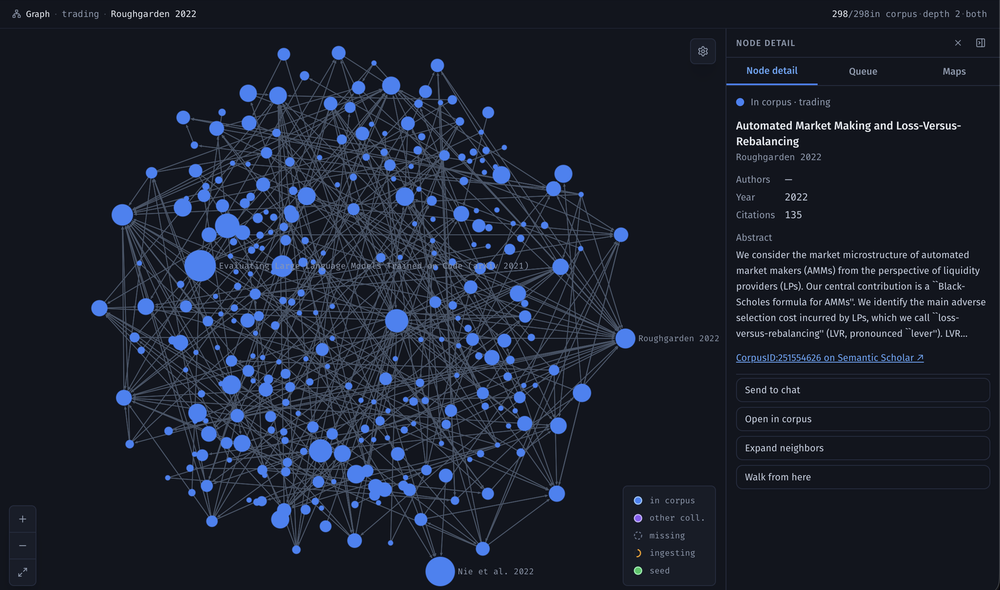
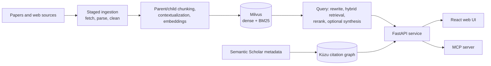

# Research RAG System

Research assistant that ingests papers and web sources, answers questions with source references using hybrid retrieval, and maps citation graphs from Semantic Scholar data. A FastAPI service serves a React web UI, and an MCP server exposes the same tools to AI agents.

**Tech:** Python · FastAPI · Milvus hybrid search (dense + BM25) · cross-encoder reranking · Kùzu graph DB · React + TypeScript · Sigma.js · MCP



The backend combines Milvus retrieval with parent-document storage, reranking, query rewriting, and optional answer synthesis. Discovery and ingestion run through persistent queues; query audits record retrieval choices, token usage, and estimated provider costs.

## Architecture



- **Ingestion** (`src/pipeline/`, `src/ingest/`) runs documents through staged fetch, parse and cleanup steps, splits them into parent and child chunks, and embeds the children. Child embeddings and retrieval fields go to Milvus; parent text and app state stay in local SQLite.
- **Query** (`src/query/`) rewrites the question, combines dense and BM25 evidence, reranks candidates, and either returns the source chunks or passes them to an LLM for a referenced answer.
- **Serving** (`src/server/`) is a FastAPI app with persistent work queues, chat storage and streaming. The React UI (`frontend/src/`) calls it directly, and the MCP server (`src/mcp_server.py`) forwards agent tool calls to the same API rather than owning a corpus.
- **Citations** (`src/citations/`) import Semantic Scholar paper metadata into a Kùzu graph that the UI explores with Sigma.js.

See [docs/architecture.md](docs/architecture.md) for component boundaries and external dependencies.

## Inspect the implementation

- [Setup and testing](docs/setup-and-testing.md): credential-free checks and external runtime requirements.
- [Security and data boundaries](docs/security-and-data-boundaries.md): local-only use, provider access, and excluded data.

Tests use synthetic inputs and mocked external services. Passing those tests does not establish retrieval quality on a real corpus or validate live provider integrations.

## Local checks

Use Python 3.11, uv, and Node.js 22.12 or newer. Run from a source checkout:

```sh
uv sync --frozen --python 3.11 --extra dev
uv run ruff check .
uv run mypy src
uv run pytest -m 'not slow and not e2e' -q
cd frontend
npm ci
npm test -- --run
npm run build
```

These checks need package downloads but no provider credentials, database server, downloaded model weights, or GPU. Running the application against documents does require external services and user-supplied data. There is no hosted demo or bundled research corpus.

## Snapshot and rights

This is a manually curated source snapshot with an independent Git history, not an automatic mirror. Private deployment configuration, research data, credentials, internal planning, and operational history are excluded. Updates are reviewed and released manually.

Source is publicly viewable for portfolio review. No license is granted for reuse.

Third-party portions retain their own terms; see [Third-party notices](THIRD_PARTY_NOTICES.md). Dependency packages and model weights are distributed separately under their respective licenses.
